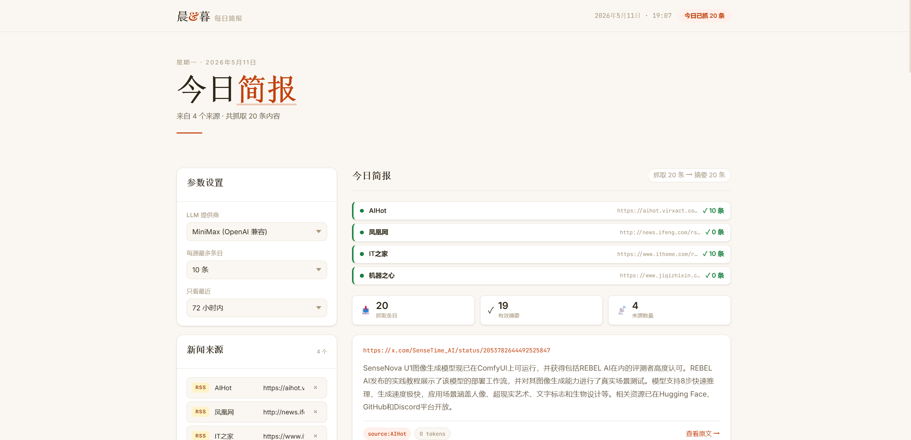

# AI News Summarizer

AI News Summarizer 是一个轻量级个人 AI 新闻简报工具。它可以从 RSS、网页、API 或本地文件抓取内容，再通过 CLI 或 FastAPI Web 界面生成中文摘要、推荐评分和历史记录。

默认配置把 `AIHot` 放在最高优先级，因为它本身已经经过大模型整理；如果 feed 没有提供明确评分，应用会再用大模型生成推荐分，并按评分从高到低展示。

## 示例截图



## 功能特性

- 多源接入：RSS、网页抓取、API、本地文件
- 多 LLM 提供商：OpenAI 兼容 API、Anthropic、Ollama
- AIHot 最高优先级，支持预摘要内容和推荐评分
- 结果按推荐评分排序，并在卡片上显示分数
- 本地历史缓存，刷新页面无需重新抓取 RSS
- 历史搜索 API 和 Web 搜索面板
- CLI 和 FastAPI Web 双入口

## 环境要求

- Python 3.11+
- `uv`
- 如需对非预摘要来源生成摘要，需要配置 LLM API Key

## 安装

```powershell
uv sync --dev
Copy-Item .env.example .env
```

编辑 `.env` 并填入需要使用的 API Key：

```env
OPENAI_API_KEY=...
ANTHROPIC_API_KEY=...
```

默认使用 MiniMax 的 OpenAI 兼容接口：

```yaml
llm:
  default: "openai"
  providers:
    openai:
      model: "MiniMax-M2.7"
      base_url: "https://api.minimax.chat/v1"
```

## 本地运行

启动 Web 界面：

```powershell
uv run uvicorn ai_news_summarizer.web.app:app --host 127.0.0.1 --port 8000
```

然后打开：

```text
http://127.0.0.1:8000
```

CLI 运行：

```powershell
uv run ai-news summarize -c ./config/default_config.yaml
```

## 默认信息源

当前默认只保留可靠的起步信息源：

- `AIHot`：`https://aihot.virxact.com/feed.xml`
- `IT之家`：`https://www.ithome.com/rss/`

AIHot 配置示例：

```yaml
sources:
  - type: "rss"
    name: "AIHot"
    params:
      url: "https://aihot.virxact.com/feed.xml"
      max_items: 20
      priority: 100
      pre_summarized: true
```

如果要添加新的 RSS，建议先确认 feed 能稳定返回内容，再加入 `config/default_config.yaml`。

## 历史缓存

每次成功运行都会保存到：

```text
data/history.json
```

该文件已被 Git 忽略。Web 页面加载时会调用：

```text
GET /api/history/latest
```

刷新页面可以直接恢复上次结果。搜索接口：

```text
GET /api/history/search?q=关键词
```

## Docker 部署

构建镜像：

```powershell
docker build -t ai-news-summarizer .
```

运行容器：

```powershell
docker run --rm -p 8000:8000 --env-file .env -v ${PWD}/data:/app/data ai-news-summarizer
```

然后访问：

```text
http://127.0.0.1:8000
```

## GitHub 准备情况

项目已经包含：

- `.gitignore`：排除密钥、虚拟环境、缓存和运行时历史
- `.dockerignore`
- `Dockerfile`
- GitHub Actions CI：`.github/workflows/ci.yml`
- 示例截图：`docs/assets/readme-example-homepage.png`

提交前建议检查：

```powershell
git status --short
```

## 安全提醒

以下文件不要提交到 Git：

- `.env`：API Key
- `.venv/`、`.venv313/`：虚拟环境
- `.uv-cache/`：依赖缓存
- `data/history.json`：运行时历史数据
- `results.html`：生成结果

## 项目文档

- `docs/maintenance-log.md`：重要变更记录
- `docs/project-health.md`：已知问题和待办事项
- `docs/roadmap-and-deployment-plan.md`：推荐演进方向和部署路线
